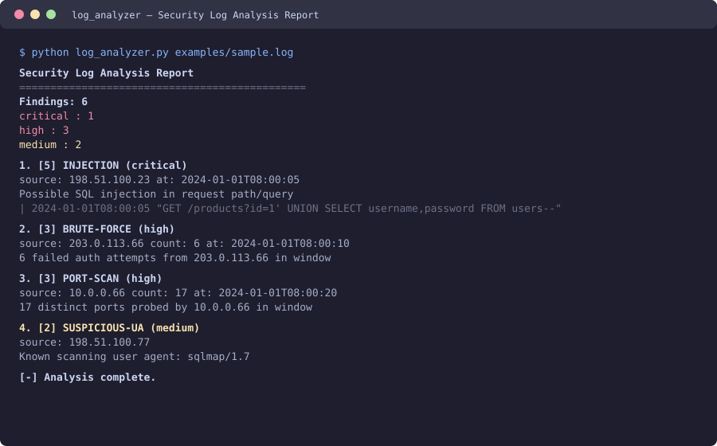
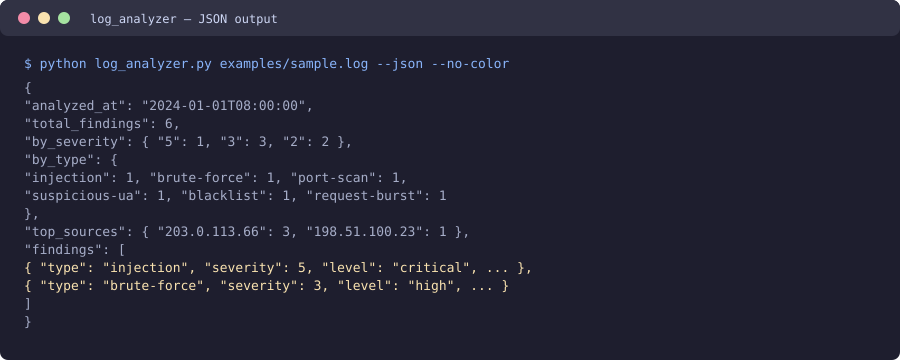

# Log Analyzer — Detectar Atividade Suspeita em Logs de Servidor / Detect Suspicious Activity in Server Logs

> 🌐 **Idiomas / Languages:** [Português (Brasil)](#português-brasil) · [English](#english)

---

# Português (Brasil)

Uma CLI do **Python sem dependências** que analisa formatos comuns de log de servidor web e sinaliza **atividade suspeita**: injeção de SQL, XSS, path traversal, logins por força bruta, varredura de portas, user-agents conhecidos por scripts maliciosos, IPs em lista de bloqueio e rajadas de requisições.

> ⚠️ **Uso defensivo / educacional.** Esta ferramenta ajuda um *defensor* a identificar indicadores de comprometimento em logs que ele possui. Ela aponta padrões para investigação — não ataca nem explora nada. Use-a somente em logs que você tem autorização para analisar.

 -brightgreen) 

---

## Funcionalidades

- **Análise de múltiplos formatos** — log combinado **Apache/nginx**, **auth log** (`sshd`/`sudo`) e linhas de chave–valor.
- **Detecção heurística** — seis analisadores para os sinais que importam:
  - `injection` (SQLi / XSS / path traversal)
  - `brute_force` (falhas repetidas de autenticação)
  - `port_scan` (muitas portas distintas a partir de uma origem)
  - `suspicious_ua` (sqlmap, nikto, masscan, nmap)
  - `blacklist` (IPs bloqueados configurados)
  - `request_burst` (pico de volume acima do baseline)
- **Pontuação de gravidade** — cada achado é `baixo(1) / médio(2) / alto(3) / crítico(5)`.
- **Saída colorida + JSON** — relatório de console legível ou `--json` para máquinas.
- **Limites ajustáveis** — janela deslizante, fator de rajada, gravidade mínima, blacklist por origem.
- **Suporte a `--stdin`** — envie logs por pipe diretamente.
- **Zero dependências de runtime** — Python 3.10+ puro, apenas biblioteca padrão.

## Por que este projeto

O triagem de logs é uma habilidade central de defesa. Este projeto mostra como construir um pequeno pipeline de detecção auditável: análise tolerante → pontuação heurística → relatório ordenado por gravidade. Como não tem dependências e é fácil de ler, é uma peça sólida de portfólio para quem está aprendendo análise de segurança de aplicações.

## Arquitetura

```
log_analyzer.py            # Ponto de entrada da CLI: argparse, entrada de arquivo/stdin, códigos de saída
└── analyzer/
    ├── parser.py          # Análise tolerante e ciente de formato → LogRecord
    ├── detector.py        # Motor heurístico (Detector, Finding, DetectorConfig)
    └── reporter.py        # Relatório de console colorido + JSON
```

O fluxo: `log_analyzer.py` lê cada linha → `parser.parse_line()` normaliza em um `LogRecord` → `Detector.add()` executa as heurísticas por registro (estado por janela e por origem) → `Detector.finalize()` emite objetos `Finding` deduplicados e ordenados por gravidade → `reporter.py` renderiza o relatório de console ou JSON.

## Instalação

```bash
git clone https://github.com/Gmotas/log-analyzer.git
cd log-analyzer
# Não precisa instalar nada — o núcleo roda em Python 3.10+ stdlib.
python log_analyzer.py --help
```

Ou instale como um pacote (opcional), que cria o comando `log-analyzer`:

```bash
pip install .
log-analyzer --help
```

Dependências de desenvolvimento (opcionais, para testes):

```bash
pip install -r requirements.txt   # apenas pytest
```

## Início rápido

```bash
# Analise o log de exemplo incluído.
python log_analyzer.py examples/sample.log

# Envie linhas de log ao vivo por pipe.
tail -f /var/log/nginx/access.log | python log_analyzer.py --stdin

# Apenas achados altos / críticos, sem cor (para scripts).
python log_analyzer.py examples/sample.log --min-severity 3 --no-color

# Saída para máquina.
python log_analyzer.py examples/sample.log --json

# Bloqueie um IP conhecido como malicioso.
python log_analyzer.py examples/sample.log --blacklist 203.0.113.66
```

### Exemplo de saída

```
Security Log Analysis Report
==============================================
Findings: 6
  critical : 1
  high     : 3
  medium   : 2

 1. [5] INJECTION (critical)
  source: 198.51.100.23  at: 2024-01-01T08:00:05
  Possible SQL injection in request path/query: /products?id=1' UNION SELECT ...
    | 2024-01-01T08:00:05 "GET /products?id=1' UNION SELECT username,password FROM users--"
  ...
 2. [3] BRUTE-FORCE (high)
  source: 203.0.113.66  count: 6  at: 2024-01-01T08:00:10
  6 failed auth attempts from 203.0.113.66 in window

[-] Analysis complete.
```

### Saída JSON

```bash
python log_analyzer.py examples/sample.log --json
```

```json
{
  "analyzed_at": "2024-01-01T08:00:00",
  "total_findings": 6,
  "by_severity": { "5": 1, "3": 3, "2": 2 },
  "by_type": { "injection": 1, "brute-force": 1, "port-scan": 1, ... },
  "top_sources": { "203.0.113.66": 3, "198.51.100.23": 1 },
  "findings": [ { "type": "injection", "severity": 5, "level": "critical", ... } ]
}
```

## Heurísticas de detecção

| Regra | O que sinaliza | Gravidade |
| --- | --- | --- |
| `injection` | SQLi (`UNION SELECT`, `sleep(`, `information_schema`), XSS (`<script`, `javascript:`), traversal (`../`, `/etc/passwd`) | crítico–alto |
| `brute_force` | ≥ N tentativas de autenticação com falha de uma origem em uma janela | alto |
| `port_scan` | Uma origem investigando ≥ N portas / hosts distintos em uma janela | alto |
| `suspicious_ua` | Ferramentas de varredura conhecidas (sqlmap, nikto, masscan, nmap) | médio |
| `blacklist` | Origem na `--blacklist` configurada | médio |
| `request_burst` | Pico de taxa de requisições ≥ `--burst-factor`× o baseline | médio |

## Notas de uso

- `--threshold` define a contagem da janela de força bruta; `--window` a janela deslizante em segundos.
- `--scan-ports` define a contagem de portas distintas da heurística de varredura de portas.
- `--min-severity` filtra ruído (`1/2/3/5`).
- `--noise-ip` suprime uma origem benigna conhecida; `--blacklist` bloqueia uma origem.
- Códigos de saída: `0` limpo, `1` achados detectados, `2` erro de uso.

## Testes

```bash
pip install pytest
pytest -q
```

A suíte cobre os analisadores e cada heurística de detecção com entrada sintética — nenhum log ao vivo ou rede é necessário.

## Capturas de tela

Os mockups de terminal abaixo mostram o **Log Analyzer em ação** — reconhecimento de padrões e classificação por gravidade. (Arquivos em `screenshots/`.)

| **Relatório de console** | **Saída JSON** |
| --- | --- |
|  |  |
| *Detecção de atividade suspeita em logs com severidade `critical / high / medium`.* | *Saída legível por máquina para integrar com outras ferramentas.* |

## Aviso / Uso ético

Esta ferramenta é **defensiva e educacional**. Ela não executa nenhuma ação de ataque — ela apenas lê logs e relata padrões que valem investigação. A detecção heurística é inerentemente ruidosa e produzirá falsos positivos e falsos negativos; sempre confirme os achados antes de agir. Analise apenas logs que você está autorizado a processar.

## Licença

MIT. Veja o `LICENSE` (ou a raiz do repositório) para detalhes.

---

# English

A **dependency-free** Python CLI that parses common web-server log formats and flags **suspicious activity**: SQL injection, XSS, path traversal, brute-force logins, port scans, known-bad user agents, blacklisted sources and request bursts.

> ⚠️ **Defensive / educational use.** This tool helps a *defender* spot indicators of compromise in logs they own. It identifies patterns to investigate — it does not attack or exploit anything. Use it only on logs you are authorized to analyze.

 -brightgreen) 

---

## Features

- **Multi-format parsing** — Apache/nginx **combined log**, **auth log** (`sshd`/`sudo`), and key–value log lines.
- **Heuristic detection** — six analyzers for the signals that matter:
  - `injection` (SQLi / XSS / path traversal)
  - `brute_force` (repeated failed auth)
  - `port_scan` (many distinct ports from one source)
  - `suspicious_ua` (sqlmap, nikto, masscan, nmap)
  - `blacklist` (configured blocked IPs)
  - `request_burst` (volume spike above baseline)
- **Severity scoring** — each finding is `low(1) / medium(2) / high(3) / critical(5)`.
- **Colorized + JSON output** — readable console report or machine-readable `--json`.
- **Tunable thresholds** — sliding window, burst factor, min-severity, per-source blacklist.
- **`--stdin` support** — pipe logs straight in.
- **Zero runtime dependencies** — pure Python 3.10+ stdlib.

## Why this project

Log triage is a core defensive skill. This project shows how to build a small, auditable detection pipeline: tolerant parsing → heuristic scoring → severity-ranked reporting. Because it has no dependencies and is easy to read, it's a solid portfolio piece for anyone learning application-security analysis.

## Architecture

```
log_analyzer.py            # CLI entry point: arg parsing, file/stdin input, exit codes
└── analyzer/
    ├── parser.py          # Format-aware, tolerant log-line parsing → LogRecord
    ├── detector.py        # Heuristic engine (Detector, Finding, DetectorConfig)
    └── reporter.py        # Colorized console + JSON report builders
```

The flow: `log_analyzer.py` reads each line → `parser.parse_line()` normalizes it into a `LogRecord` → `Detector.add()` runs the per-record heuristics (windowed and per-source state) → `Detector.finalize()` emits deduped, severity-ranked `Finding` objects → `reporter.py` renders the console report or JSON.

## Installation

```bash
git clone https://github.com/Gmotas/log-analyzer.git
cd log-analyzer
# No install required — the core runs on Python 3.10+ stdlib.
python log_analyzer.py --help
```

Or install it as a package (optional), which creates the `log-analyzer` command:

```bash
pip install .
log-analyzer --help
```

Dev deps (optional, for tests):

```bash
pip install -r requirements.txt   # pytest only
```

## Quickstart

```bash
# Analyze the bundled sample log.
python log_analyzer.py examples/sample.log

# Pipe live log lines in.
tail -f /var/log/nginx/access.log | python log_analyzer.py --stdin

# Only high / critical findings, no color (for scripting).
python log_analyzer.py examples/sample.log --min-severity 3 --no-color

# Machine-readable output.
python log_analyzer.py examples/sample.log --json

# Block a known-bad IP.
python log_analyzer.py examples/sample.log --blacklist 203.0.113.66
```

### Sample output

```
Security Log Analysis Report
==============================================
Findings: 6
  critical : 1
  high     : 3
  medium   : 2

 1. [5] INJECTION (critical)
  source: 198.51.100.23  at: 2024-01-01T08:00:05
  Possible SQL injection in request path/query: /products?id=1' UNION SELECT ...
    | 2024-01-01T08:00:05 "GET /products?id=1' UNION SELECT username,password FROM users--"
  ...
 2. [3] BRUTE-FORCE (high)
  source: 203.0.113.66  count: 6  at: 2024-01-01T08:00:10
  6 failed auth attempts from 203.0.113.66 in window

[-] Analysis complete.
```

### JSON output

```bash
python log_analyzer.py examples/sample.log --json
```

```json
{
  "analyzed_at": "2024-01-01T08:00:00",
  "total_findings": 6,
  "by_severity": { "5": 1, "3": 3, "2": 2 },
  "by_type": { "injection": 1, "brute-force": 1, "port-scan": 1, ... },
  "top_sources": { "203.0.113.66": 3, "198.51.100.23": 1 },
  "findings": [ { "type": "injection", "severity": 5, "level": "critical", ... } ]
}
```

## Detection heuristics

| Rule | What it flags | Severity |
| --- | --- | --- |
| `injection` | SQLi (`UNION SELECT`, `sleep(`, `information_schema`), XSS (`<script`, `javascript:`), traversal (`../`, `/etc/passwd`) | critical–high |
| `brute_force` | ≥ N failed auth attempts from one source in a window | high |
| `port_scan` | One source probing ≥ N distinct ports / hosts in a window | high |
| `suspicious_ua` | Known scanning tools (sqlmap, nikto, masscan, nmap) | medium |
| `blacklist` | Source on the configured `--blacklist` | medium |
| `request_burst` | Request rate spike ≥ `--burst-factor`× baseline | medium |

## Usage notes

- `--threshold` sets the brute-force window count, `--window` the sliding window in seconds.
- `--scan-ports` sets the distinct-port count for the port-scan heuristic.
- `--min-severity` filters noise (`1/2/3/5`).
- `--noise-ip` suppresses a known-benign source; `--blacklist` blocks a source.
- Exit codes: `0` clean, `1` findings detected, `2` usage error.

## Testing

```bash
pip install pytest
pytest -q
```

The suite covers the parsers and each detection heuristic with synthetic input — no live logs or network needed.

## Screenshots

The terminal mockups below show the **Log Analyzer in action** — pattern recognition and severity classification. (Files in `screenshots/`.)

| **Console report** | **JSON output** |
| --- | --- |
|  |  |
| *Detection of suspicious log activity with `critical / high / medium` severity.* | *Machine-readable output for integration with other tooling.* |

## Disclaimer / Ethical Use

This tool is **defensive and educational**. It performs no attacking actions — it only reads logs and reports patterns worth investigating. Heuristic detection is inherently noisy and will produce false positives and negatives; always confirm findings before acting. Only analyze logs you are authorized to process.

## License

MIT. See `LICENSE` (or the repo root) for details.
